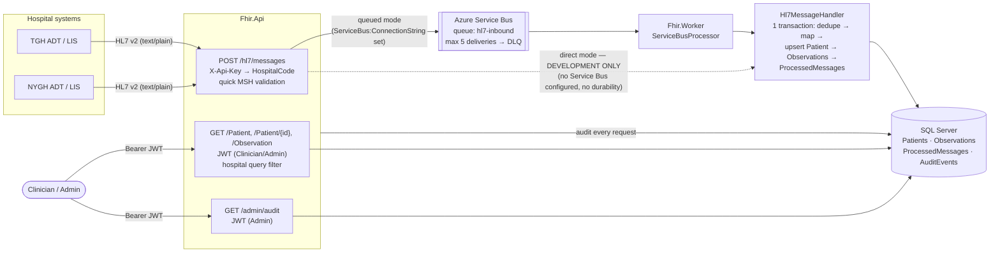

# FHIR Patient Data Platform

Ingests HL7 v2 messages, converts them to FHIR R4, and serves them securely to clinicians.

## Architecture



| Project | Responsibility |
|---|---|
| `Fhir.Domain` | Entities: `PatientRecord`, `ObservationRecord`, `ProcessedMessage`, `AuditEvent` |
| `Fhir.Application` | Contracts: `IHl7ToFhirMapper`, `IHl7MessageHandler`, `IHl7MessagePublisher`, `ICurrentUser`, `IAuditLogger`, `Hl7Header` |
| `Fhir.Infrastructure` | NHapi/Firely mapper, EF Core (`FhirDbContext`, migrations), `Hl7MessageHandler`, publishers, `AuditLogger` |
| `Fhir.Api` | Ingest, FHIR read and admin endpoints; JWT + API-key authentication |
| `Fhir.Worker` | Service Bus processor on `hl7-inbound` (runs only when `ServiceBus:ConnectionString` is set) |

**Message processing.** `Hl7MessageHandler` does everything in one database transaction: duplicate check on
(MSH-4, MSH-10) in `ProcessedMessages` → map with NHapi/Firely → upsert the patient by (HospitalCode, MRN) → insert
observations with `subject = Patient/{stored id}` → record the message → commit. ADT updates demographics; an ORU for an
unknown patient creates the patient from PID.

**Publishing modes.**

- **Queued** (`ServiceBus:ConnectionString` configured): the API returns `202` only after `SendMessageAsync` succeeds
  (`MessageId` = MSH-10), `503` if it fails. The Worker completes on success or duplicate, dead-letters
  `Hl7ValidationException` with reason `ValidationFailed`, and leaves other failures unsettled so Service Bus redelivers
  after the 1-minute lock (dead-lettered after 5 attempts).
- **Direct** (no Service Bus, **Development only**): the API runs the handler in-process. `202` processed, `200`
  duplicate ignored, `422` validation error. A startup warning says durability is disabled. Outside Development the API
  refuses to start without a Service Bus connection string.

## Security model

| Caller | Authenticates with | Can do |
|---|---|---|
| Hospital system | `X-Api-Key` header (key → HospitalCode) | `POST /hl7/messages` for its own hospital only (MSH-4 must match, else `403`) |
| Clinician | JWT, role `Clinician`, claim `hospital` | Read Patients/Observations of their hospital |
| Admin | JWT, role `Admin` | Everything a clinician can (for their `hospital`) plus `GET /admin/audit` (all hospitals) |

Policies: `CanReadPatients` = role Clinician or Admin **and** a `hospital` claim; `AdminOnly` = role Admin;
`HospitalSystem` = API-key scheme only.

**Hospital isolation.** EF Core global query filters on `Patients` and `Observations` restrict every query to
`HospitalCode == ICurrentUser.HospitalCode`; a user without a hospital claim sees nothing. Message processing has no
user and uses an explicit system context (`IFhirDbContextFactory.CreateSystemContext()`), which is never used by read
endpoints. Requesting another hospital's patient returns `404`, the same as a non-existent id, so existence is not
revealed; the audit row records `Denied`. `IgnoreQueryFilters()` is used only for that existence check.

**Audit.** Every ingest and read is written to `AuditEvents` (user, hospital, action, resource type/id, outcome
`Success`/`Denied`/`Failed`, IP, correlation id). Identifiers only, never clinical values or names. The table is
append-only:

1. `FhirDbContext.SaveChanges` throws if any `AuditEvent` is modified or deleted.
2. The `TR_AuditEvents_AppendOnly` trigger (`INSTEAD OF UPDATE, DELETE`) rejects changes in the database itself.

In production, also deny `UPDATE`/`DELETE`/`ALTER` on the table to the application's database user (a trigger does not
stop `TRUNCATE` or someone who can drop it).

### Moving to Microsoft Entra ID

JWT bearer reads `Authentication:Schemes:Bearer`, so switching from `dotnet user-jwts` to Entra ID is configuration only:

```json
"Authentication": {
  "Schemes": {
    "Bearer": {
      "Authority": "https://login.microsoftonline.com/{tenantId}/v2.0",
      "ValidAudiences": [ "api://{api-client-id}" ]
    }
  }
}
```

- In the API's app registration, define **app roles** `Clinician` and `Admin` and assign users or groups. Entra puts them
  in the `roles` claim, which ASP.NET Core maps to role claims.
- Emit a `hospital` claim, e.g. a directory extension attribute or custom claims provider in the token configuration.
- Ingest API keys stay as they are (or move to client-credential tokens for hospital systems later).

## Run locally

Prerequisites: .NET 10 SDK and SQL Server LocalDB (`sqllocaldb info` lists `MSSQLLocalDB`). No Docker or Azure needed.

```powershell
dotnet build
dotnet test
dotnet run --project src/Fhir.Api --launch-profile http   # http://localhost:5135
```

In Development the API applies EF Core migrations to `(localdb)\MSSQLLocalDB`, database `FhirPlatform`, and runs in
direct mode. The OpenAPI document is at `/openapi/v1.json`.

### Configuration and secrets

| Key | Development value | Elsewhere |
|---|---|---|
| `ConnectionStrings:FhirDb` | LocalDB (`appsettings.Development.json`) | user-secrets / app settings |
| `Ingest:ApiKeys` | `dev-tgh-ingest-key` → TGH, `dev-nygh-ingest-key` → NYGH (dev only) | user-secrets / Key Vault |
| `ServiceBus:ConnectionString` | not set → direct mode | user-secrets / Key Vault (never in Git) |
| `Authentication:Schemes:Bearer` | written by `dotnet user-jwts` | Entra ID (see above) |

```powershell
dotnet user-secrets set "ServiceBus:ConnectionString" "<connection string>" --project src/Fhir.Api
dotnet user-secrets set "ServiceBus:ConnectionString" "<connection string>" --project src/Fhir.Worker
dotnet user-secrets set "Ingest:ApiKeys:0:Key" "<long random key>" --project src/Fhir.Api
dotnet user-secrets set "Ingest:ApiKeys:0:HospitalCode" "TGH" --project src/Fhir.Api
```

With a connection string set, also run `dotnet run --project src/Fhir.Worker`. Provision the queue with
[`infra/`](infra/README.md).

## Demo (PowerShell)

Terminal 1, the API:

```powershell
dotnet run --project src/Fhir.Api --launch-profile http
```

Terminal 2, from the repo root:

```powershell
$api = "http://localhost:5135"

# 1. Tokens: a TGH clinician, an NYGH clinician and an admin
$tgh   = dotnet user-jwts create --project src/Fhir.Api --name dr.tgh  --role Clinician --claim hospital=TGH  --output token
$nygh  = dotnet user-jwts create --project src/Fhir.Api --name dr.nygh --role Clinician --claim hospital=NYGH --output token
$admin = dotnet user-jwts create --project src/Fhir.Api --name admin   --role Admin     --claim hospital=TGH  --output token

# 2. Ingest with each hospital's API key
function Send-Hl7($file, $key) {
    curl.exe -s -w " -> HTTP %{http_code}`n" -X POST "$api/hl7/messages" `
        -H "Content-Type: text/plain" -H "X-Api-Key: $key" --data-binary "@samples/hl7/$file"
}
Send-Hl7 ADT_A01.hl7         dev-tgh-ingest-key    # 202 processed (Jane Doe, TGH)
Send-Hl7 ORU_R01.hl7         dev-tgh-ingest-key    # 202 processed (glucose for Jane)
Send-Hl7 ADT_A01_NYGH.hl7    dev-nygh-ingest-key   # 202 processed (Arjun Singh, NYGH)
Send-Hl7 ADT_A01_BAD_DOB.hl7 dev-tgh-ingest-key    # 422 PID-7 invalid
Send-Hl7 ADT_A01.hl7         dev-tgh-ingest-key    # 200 duplicate ignored
Send-Hl7 ADT_A01_NYGH.hl7    dev-tgh-ingest-key    # 403 MSH-4 does not match the key

# 3. The TGH clinician sees only Jane
$tghPatients = curl.exe -s -H "Authorization: Bearer $tgh" "$api/Patient" | ConvertFrom-Json
$tghPatients.entry.resource | Select-Object id, @{ n = "name"; e = { $_.name[0].family } }
$janeId = $tghPatients.entry[0].resource.id
curl.exe -s -H "Authorization: Bearer $tgh" "$api/Observation?patient=$janeId"

# 4. ...and gets 404 for the NYGH patient
$nyghId = (curl.exe -s -H "Authorization: Bearer $nygh" "$api/Patient" | ConvertFrom-Json).entry[0].resource.id
curl.exe -s -o NUL -w "TGH clinician -> NYGH patient: HTTP %{http_code}`n" -H "Authorization: Bearer $tgh" "$api/Patient/$nyghId"

# 5. The admin sees the Denied row; a clinician cannot see the audit at all
curl.exe -s -H "Authorization: Bearer $admin" "$api/admin/audit?patientId=$nyghId" | ConvertFrom-Json |
    Format-Table timestampUtc, userId, hospitalCode, action, resourceId, outcome
curl.exe -s -o NUL -w "Clinician -> /admin/audit: HTTP %{http_code}`n" -H "Authorization: Bearer $tgh" "$api/admin/audit"
```

To start again from an empty database: `dotnet ef database drop --force --project src/Fhir.Infrastructure --startup-project src/Fhir.Api`.
